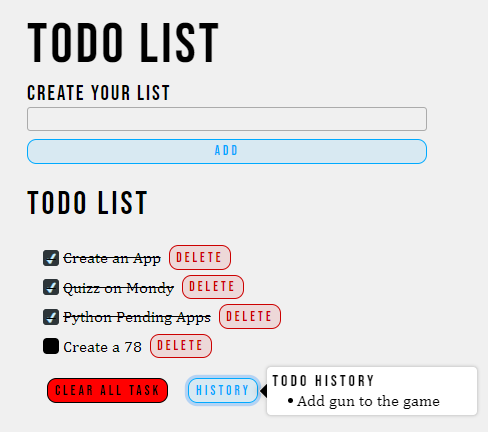

# Your Todos

<!--Remove the below lines and add yours -->

This React script serves as your todo check list
https://your-todos.pages.dev

### Features

Adding new to-do items.
Toggling the completion status of to-do items.
Deleting to-do items.
Clearing all to-do items.
Viewing the history of to-do items.

### How to run the script

<!--Remove the below lines and add yours -->

```
$ npm run build
$ npm run dev
```

### Screenshot/GIF showing the sample use of the script

<!--Remove the below lines and add yours -->


### Important Files

config.py: Configuration file containing API keys.

## Working

The component imports required dependencies, including React's useState hook, the Popup component from 'reactjs-popup', and the crypto library for generating unique IDs.
The component uses several state variables:
newItem: the input value for the new to-do item.
todos: the array of current to-do items.
historys: the array of deleted to-do items.
The handleSubmit function is called when the user submits the form to add a new to-do item. It checks if the input value is not empty and adds the new item to the todos state.
The Toggletodo function updates the completion status of a specific to-do item in the todos state.
The deleteTodo function removes a to-do item from the todos state and adds it to the historys state.
The deletealltodos function removes all to-do items from the todos state and adds them to the historys state.
The component renders a form for adding new to-do items, a list of current to-do items, and buttons for clearing all to-do items and viewing the to-do history.
The Popup component from 'reactjs-popup' is used to display the to-do history when the user clicks the "History" button.

## _Author Name_

<!--Remove the below lines and add yours -->
This script was created by [milliyin](https://github.com/milliyin)
Feel free to contribute to this project by submitting issues or pull requests.
